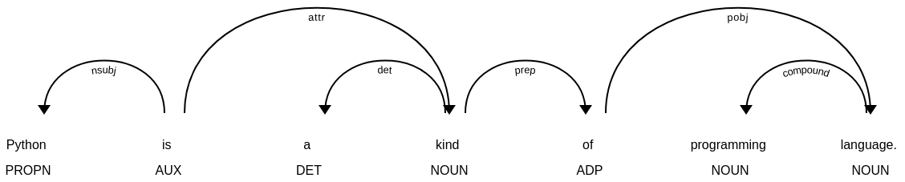

# Data collection process

## Notations
To avoid confusion, some notations and their explanations are introduced in this section:

1. **Wikipedia entity**: In this setting, we use all the wikipedia page titles as the wikipedia entities. Each wikipedia entity is unique in the dataset. It is possible that some links in the wikipedia page do not match any wikipedia page title and need redirecting to get to the true wikipedia page. In that situation, we won't consider the link as an occurrance of the wikipedia entity.
2. **Keyword**: Entity name may contain some disambiguation information, which may not appear in the wikipedia page text. For example, in entity name *Python (programming language)*, "(programming language)" is the disambiguation information, and in entity name *San Jose, California*, "California" is the disambiguation information. Thus, to find the occurrance of an entity in the wikipedia page, we use the **keyword** form. **Keyword** is the lower-cased **wikipedia entity** name after removing the disambiguation information. For example:
    + *Python (programming language)* &#8594; *python*
    + *San Jose, California* &#8594; *san jose*
3. **Dependency path**: Dependency path is a sequence of dependency notations connecting two word tokens in a sentence. In a dependency tree, the "in" edge of a token will be appended with a "i_" notation. For example, in the following dependency tree, the dependency path from *python* to *language* is *i_nsubj attr prep pobj*.

4. **Root token in span**: Sometimes the subject or object in a sentence can be a phrase instead of a single token. For example, in the previous image, the object is *programming language* instead of *language*. In a span of consecutive tokens, we call the token whose parent token is out of the span or is itself as the **root token**. For example, in the previous example, the **root token** for *programming language* is *language*, while the **root token** for *a kind of programming language* is *kind*.
5. **Dependency path between spans**: The dependency path between two spans is the dependency path between the root tokens in the spans.
6. **Dependency path pattern**: In the later introduction, we will make use of the frequency of each **dependency path**. Since some dependencies are trival in understanding the relation, but will decrease the frequency of the path, we simplify the original **dependency path** to the **dependency path pattern** by removing some dependencies under some situations. In our implementation, we 
    + remove *appos* and *conj*, which mean "apposition" and "conjunction", under any situation.
    + replace *prep prep* with single *prep*, which will happen when two consecutive prepositions appear, like "xxx out of xxx"

---

## Data collection

### Step 1: Collect sentences, entities, entities co-occurrances, titles from wikipedia dump

- run ```python extract_wiki.py collect_sent_and_cooccur``` in the terminal. The code will loop through all the lines in all the wikipedia dump files and for each non-empty line:
    - if the line matches the pattern *\<doc id="xx" url="xxx" title="xxx">*, it means the beginning of a new wikipedia page. We 
        1. **extract the entity name** and 
        2. **initialize the keyword list**.
    - if the line is *\</doc>*, it means the ending of present wikipedia page and we do nothing for this line.
    - otherwise, the line is a paragraph in the page of present wikipedia entity. We 
        1. **extract the entity links from this paragraph**,
        2. **add new keywords into the keyword list**,
        3. **replace links with the corresponding keywords**,
        4. **split paragraph into sentences**,
        5. **tokenize each sentence and rejoin the tokens with spaces**,
        6. **find entity co-occurrance for each sentence using the keyword list**

- Three files will be generated for each wikipedia dump file: *wiki_xx.dat*, *wiki_xx_co.dat* and *wiki_xx_ti.dat*, recording the sentences, entity co-occurrance and wikipedia page title correspondingly.


### Step 2: Correct entity mapping in co-occurrance files

1. The entity co-occurrance data collected from previous step is not clean. Some entities may not match any wikipedia title because of the case of the letters or page redirection. To correctly map each entity to a wikipedia page title, we walk through several checkpoints for each entity

    - if there is a direct match between the entity and the wikipedia page titles, we do not change it.
    - if the lower-cased entity is unique in all lower-cased titles, we change the entity to the corresponding page title.
    - if the lower-cased entity is not unique among the titles, we find all the page titles that have the same lower-cased form, and find the one that is most related to the topic of that sentence (using the *wiki_xx_ti.dat* file and the *Wikipedia2Vec* entity embedding)

### Step 3: Collect basic dataset

1. To evaluate the quality of a sentence in describing the relation between two entities, one metric is the frequency of the dependency path connecting the two entities (referring the WOE Openie tool). To get the dependency path frequency data, we do the following steps:

    - We first randomly collect 30k sentences,
    - for each sentence, we find all the dependency paths connecting two entities. We only keep the path that contains "subj" inside and the similarity between two entities is greater than 0.4.
    - for each path, we remove the "conj" and "appos", replace "prep prep" with single "prep"
    - finally, we use all the selected paths to collect the path frequency data.

2. With the dependency path frequency data, we start collecting the basic dataset.

    - For each pair of entities in a sentence, we have several factors for calculating the score:
        1. **keyword token recall**: a target entity may not be a completed phrase in the sentence, for example, in "data mining tasks may use machine learning tools", entity "machine learning" is part of the phrase "machine learning tools". The more accurate the entity is, the better the sentence is.
        2. **dependency path frequency**: instead of finding the dependency path between two entities, we collect the dependency between two completed phrases that contain the entities. We collect dependency path in this way to reduce some noise in the path.
        3. **coverage**
    - The score of a sentence is calculated as **keyword token recall**^0.35 x **coverage**^0.35 x **dependency path frequency**^0.3